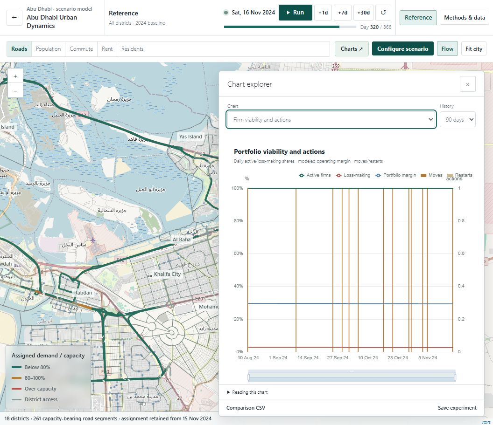
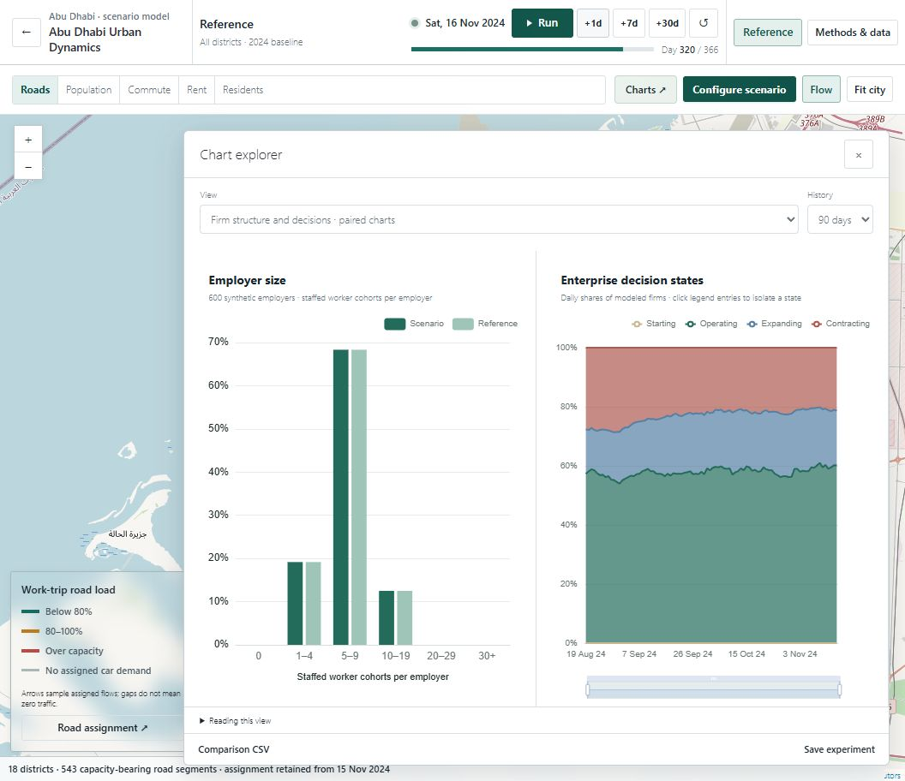

# Paired analysis and shared-road congestion — 12 September 2026

The requested revision groups related outputs into seven on-demand analysis views. Each mounts two charts; all 27 individual charts remain available. City indicators open related pairs. The default map remains free of chart panels until one is requested.

The new views combine outcome comparisons, complete distributions, ranked district comparisons, a rent/commute scatterplot, state composition and transition heatmaps. Units and observation periods stay explicit. Resident budget groups remain citywide while the transition district control filters its companion heatmap. Empty observations are labeled; they are not fabricated as zero.

## Visual review

The firm comparison uses the same 1056 × 912 desktop dimensions, reference scenario, day 320 and 90-day history window. The before image is the user's original single viability plot; the after image is the new firm analysis entry point. The road correction changes the simulated values, and the map retains different zoom levels, so the images compare presentation rather than numerical equivalence.

| Before | After |
| --- | --- |
|  |  |

The paired view gives employer size its own distribution and firm states their own composition history. Both plots fit at the observed desktop pane size. Axis labels were shortened or wrapped, transition origin/destination labels were separated, and duplicate coverage legends were removed. Shorter 1280 × 720 windows retain a scrollable plot area rather than shrinking the charts until labels overlap.

Other reviewed views: [transport](transport.png), [housing](housing.png), [residents](residents.png), [road assignment](roads.png).

## Road correction

The Yas–Mussafah investigation found that real shared streets had been exempted from capacity loading. These were not synthetic centroid connectors. All 543 physical roads now take directional car and transit assignment; real approaches and roads crossing district boundaries receive the sum of all applicable outbound and return traversals.

The opening reference run assigns cars to 541 segments, transit alone to one, and neither mode to one. A remaining unused segment is therefore distinct from the removed congestion exemptions. Geometry, legal directions and free-flow distances/times remain unchanged. Five newly eligible roads gain observed lane counts through the existing strict join; capacity formulas are unchanged.

The [reproducible shared-load trace](../abu-dhabi-urban-dynamics-2026-09-11/yas-musaffah-shared-congestion.md) records every path segment and independent load reconciliation at days 0 and 30. Sparse, slow arrows remain a sample of assignment, not one symbol on every used segment.

## Verification

- Browser checks exercised all 34 choices: seven pairs mounted exactly two nonzero-sized plots; 27 individual choices mounted one. [Recorded mounts](chart-mount-check.json).
- District and seven-day transition filtering, reference visibility, continuous playback, long retained histories and repeated chart switching were exercised in the browser. No browser errors were recorded.
- Distribution/accounting, date matching, missing data, signed comparison, chart title refresh and chart-family routing checks pass.
- Full model validation passed 143 structural checks over the original six one/ten-year cases. All 14 full-scale seed/sensitivity runs passed. The road load ledger is independently reconstructed from assigned routes.
- Production delivery preserves the exact validated worker and baseline bytes. A scoped Jekyll hook and minifier exclusions prevent transformations of those two files; the site contract compares their published SHA-256 hashes to the validated sources. Other assets retain their normal build processing.
- The reference one-year case has one diagnostic above its provisional directional capacity threshold (V/C 2.0633). This remains visible. A single gateway per district can concentrate local demand, and observed traffic calibration is still absent. Zero vehicle acquisitions remain a separate documented behavioral concern.

This revision does not establish a validated traffic forecast. It fixes real shared-road accounting and makes the model's outputs and remaining assumptions easier to inspect.
